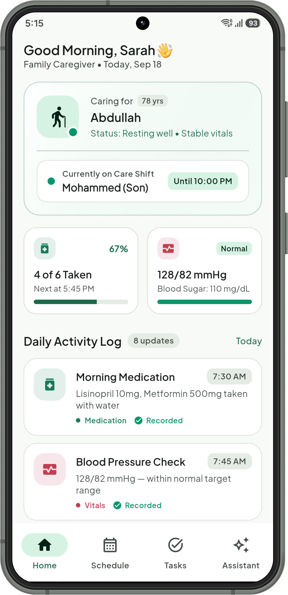
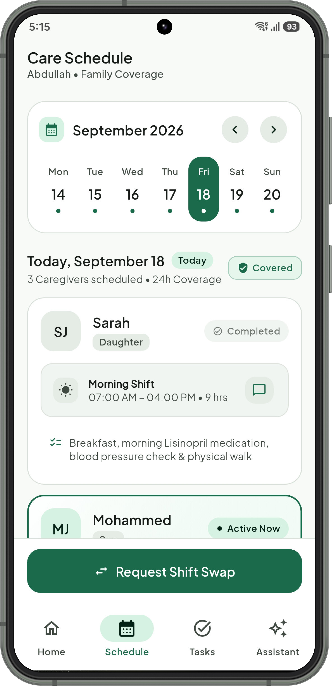
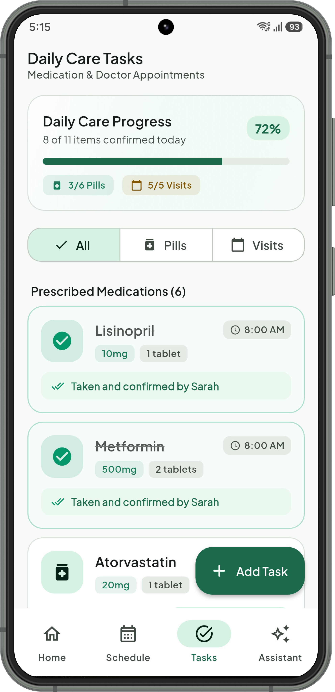
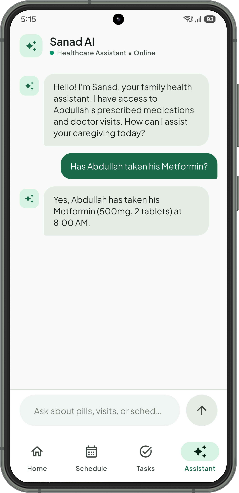

<h3 align="center">Made with ❤️ at Tuwaiq Academy</h3>

<p align="center">
  
</p>

<h1 align="center">🌱 Rifq (رِفق)</h1>

<p align="center">
  <strong>Compassionate, coordinated caregiving for your elderly loved ones.</strong><br />
  Empowering families with seamless 24/7 care shifts, medication tracking, and a context-aware AI healthcare companion.
</p>

<p align="center">
  <a href="https://flutter.dev">
    
  </a>
  <a href="https://dart.dev">
    
  </a>
  <a href="https://supabase.com">
    
  </a>
  <a href="https://azure.microsoft.com/en-us/products/ai-services/openai-service">
    
  </a>
  <a href="https://m3.material.io">
    
  </a>
  <a href="https://github.com/TeamRifq/Rifq/actions">
    
  </a>
  <a href="https://www.android.com">
    
  </a>
</p>

---

## 📱 User Interface

<div align="center">
  <table>
    <tr>
      <th align="center" width="25%">🏠 Home Overview</th>
      <th align="center" width="25%">📅 Care Schedule</th>
      <th align="center" width="25%">💊 Daily Care Tasks</th>
      <th align="center" width="25%">🤖 Sanad AI Assistant</th>
    </tr>
    <tr>
      <td align="center" valign="middle" width="25%">
        
      </td>
      <td align="center" valign="middle" width="25%">
        
      </td>
      <td align="center" valign="middle" width="25%">
        
      </td>
      <td align="center" valign="middle" width="25%">
        
      </td>
    </tr>
    <tr>
      <td align="center" valign="top" width="25%">
        <sub><b>Real-time status, active caregiver, vitals summary & live daily activity feed</b></sub>
      </td>
      <td align="center" valign="top" width="25%">
        <sub><b>Interactive weekly calendar strip, round-the-clock shift roster & swap requests</b></sub>
      </td>
      <td align="center" valign="top" width="25%">
        <sub><b>Prescribed medication doses, doctor appointments & quick task creation</b></sub>
      </td>
      <td align="center" valign="top" width="25%">
        <sub><b>Context-grounded AI companion answering queries about pills and clinical visits</b></sub>
      </td>
    </tr>
  </table>
</div>

---

## 📥 Get Rifq for Android

You do not need to set up Flutter or build from source to try Rifq on your Android phone! Every production and CI build is automatically compiled and uploaded as an artifact through **GitHub Actions**.

### How to Download the Android APK:

1. Go to the **[Actions](../../actions)** tab at the top of this GitHub repository.
2. Select the latest completed workflow run from **[Flutter Publish](../../actions/workflows/publish.yml)**.
3. Scroll down to the **Artifacts** section at the bottom of the workflow summary page.
4. Click on **`app-release`** to download the ZIP file.
5. Extract the downloaded ZIP to find `app-release.apk`.
6. Transfer the APK to your Android device (or download directly using your phone's web browser) and tap to install.

---

## 📖 About Rifq

**Rifq** (derived from the Arabic رِفق, denoting gentleness, tender compassion, and benevolent care) is a Flutter mobile application crafted to address the daily complexities of family caregiving for elderly relatives.

Caring for an aging family member often involves multiple relatives siblings, grandchildren, and spouses juggling busy work schedules while managing intricate medication regimens, frequent doctor appointments, and round-the-clock supervision. Communication gaps frequently lead to accidental double-dosing, missed medications, or uncovered shifts.

**Rifq** transforms this stressful journey into a harmonized, compassionate experience. By providing real-time visibility into who is currently on care duty, structured shift swaps, transparent pill administration logs, and **Sanad (سَنَد)** an intelligent AI assistant strictly grounded in the elder's medical records Rifq ensures your loved one receives consistent, loving, and mistake-free care.

---

## ✨ Core Features

### 🏠 1. Care Overview & Live Activity Feed
- **Elder Care Status:** Instant visibility of your loved one's condition (e.g., Abdullah, 78 yrs   Resting well • Stable vitals).
- **Active Caregiver Spotlight:** Real-time indicator displaying who is currently on duty (e.g., Mohammed (Son)) and when their shift ends.
- **Quick Metrics:** High-level daily adherence summary showing completed medications (`4 of 6 Taken • 67%`) and latest vitals (`128/82 mmHg • Blood Sugar: 110 mg/dL`).
- **Chronological Activity Log:** Live updates detailing daily occurrences medication intake, blood pressure checks, meals, afternoon walks, and physical therapy sessions.

### 📅 2. 24/7 Care Schedule & Shift Swapping
- **Interactive Weekly Calendar:** Day-by-day calendar strip featuring coverage dots for instant visibility of covered and pending days.
- **Round-the-Clock Shifts:** Morning, Afternoon, and Night shifts detailing the responsible caregiver, family relationship, scheduled hours, and duty summaries.
- **Direct Family Communication:** One-tap quick messaging and call shortcuts to connect directly with the caregiver currently on duty.
- **Emergency Shift Swap (`ShiftSwapDialog`):** Caregivers can request shift coverage or swap duties with available family members (`Mohammed`, `Layla`, `Ahmed`, or notify all relatives), complete with personalized notes.

### 💊 3. Medication & Appointment Management
- **Segmented Care Checklist:** Material 3 segmented controls to instantly switch between **All**, **Pills**, and **Visits**.
- **Comprehensive Pill Tracker:** Displays drug name, dosage (e.g., `10mg`, `500mg`), tablet count, intake time, and clear confirmation tags showing which family member administered the dose.
- **Clinical Doctor Visits:** Tracks upcoming specialist visits (e.g., Cardiology, Dental, Eye exams), clinic dates, appointment times, and handling status.
- **Quick Creation Dialogs:** Built-in modal dialogs (`AddPillScreen` and `AddVisitScreen`) with input validation to rapidly add new prescriptions and doctor visits.

### 🤖 4. "Sanad" (سَنَد) AI Healthcare Assistant
- **Context-Grounded Intelligence:** Built on **Azure OpenAI** (`gpt-4.1-mini`) via the `ai_sdk_dart` and `ai_sdk_azure` packages.
- **Safe & Hallucination-Resistant:** Sanad is strictly grounded with the patient's actual recorded prescriptions and clinic visits. If asked about information outside the patient's verified care plan, Sanad safely defers.
- **Suggested Prompts:** Quick one-tap question chips such as:
  - *"What pills are scheduled today?"*
  - *"Has Abdullah taken his Metformin?"*
  - *"When is the next doctor appointment?"*
  - *"Who is taking care of Abdullah today?"*

---

## 🎨 Design System & Aesthetics

Rifq is built from the ground up following the **Material Design 3 (M3)** design specification:

- **Typography:** Configured with [Plus Jakarta Sans](https://fonts.google.com/specimen/Plus+Jakarta+Sans) through `google_fonts`, providing crisp legibility, warm tones, and modern hierarchy.
- **Palette:** A soothing, nature-inspired palette engineered for healthcare peace of mind:
  - **Primary:** Forest Green (`#1B6A4C`) & Soft Mint Container (`#D6F2E2`)
  - **Surface:** Soft Porcelain (`#F7FAF7`) with crisp card containers (`#FFFFFF`)
  - **Categorical Accents:** Medication Emerald (`#197A57`), Vitals Crimson (`#C83C52`), Nutrition Amber (`#C2691B`), and Activity Azure (`#1E6F9F`).
- **Tactile UI Elements:** Generous border radii (16–24px), refined stroke borders, expressive chip states, and responsive modal bottom sheets.

---

## 🛠️ Architecture & Tech Stack

Rifq is architected around a clear separation of concerns across presentation, domain state, and backend infrastructure:

- **Presentation Layer:** Built with Flutter and Material 3, containing intuitive screens (`HomeScreen`, `ScheduleScreen`, `TasksScreen`, `AssistantScreen`) and modular UI widgets (`CareShiftCard`, `PillWidget`, `VisitWidget`, `ShiftSwapDialog`).
- **Domain & State Services:** Reactive data providers (`PillService`, `VisitService`, `AiService`) managing patient records, shift coverage, and LLM communication.
- **Infrastructure & Cloud:** Supabase for cloud data persistence and real-time sync, `flutter_dotenv` for secure environment configuration, and GitHub Actions for continuous integration.

### Core Technologies

| Technology | Purpose |
|---|---|
| **[Flutter](https://flutter.dev/)** | Cross-platform framework with Material Design 3 |
| **[Dart](https://dart.dev/)** | Sound null-safe modern object-oriented language |
| **[Supabase Flutter](https://supabase.com/)** | Cloud data storage, real-time sync, and backend services |
| **[Azure OpenAI](https://azure.microsoft.com/)** | Enterprise-grade LLM backing the Sanad AI assistant |
| **[ai_sdk_dart](https://pub.dev/packages/ai_sdk_dart)** & **[ai_sdk_azure](https://pub.dev/packages/ai_sdk_azure)** | Dart AI abstraction layer for generative model completions |
| **[flutter_dotenv](https://pub.dev/packages/flutter_dotenv)** | Secure runtime configuration from `.env` |
| **[Google Fonts](https://pub.dev/packages/google_fonts)** | Plus Jakarta Sans typography |
| **[GitHub Actions](https://github.com/features/actions)** | Automated release compilation and continuous integration |

---

##  Getting Started

If you want to run or develop Rifq locally, follow these steps:

### Prerequisites

- [Flutter SDK](https://docs.flutter.dev/get-started/install) (`^3.13.3` or higher)
- [Dart SDK](https://dart.dev/get-dart) (`^3.0.0` or higher)
- [Android Studio](https://developer.android.com/studio) or VS Code with Flutter extension
- JDK 17
- A [Supabase](https://supabase.com/) account & project
- An [Azure OpenAI](https://azure.microsoft.com/) resource deployment (`gpt-4.1-mini` or compatible model)

### 1. Clone the Repository

```bash
git clone https://github.com/TeamRifq/Rifq.git
cd Rifq/rifq
```

### 2. Configure Environment Variables

Create a `.env` file in the `rifq/` directory:

```bash
# On Windows PowerShell
New-Item -ItemType File .env

# On macOS/Linux
touch .env
```

Populate `.env` with your credentials:

```ini
# Azure OpenAI Configuration
AZURE_AI_ENDPOINT=https://<your-resource-name>.services.ai.azure.com/openai/v1/responses
AZURE_AI_API_KEY=your_azure_openai_api_key
AZURE_AI_MODEL=gpt-4.1-mini

# Supabase Configuration
SUPABASE_URL=https://<your-project-ref>.supabase.co
SUPABASE_ANON_KEY=your_supabase_anon_key
```

> 🔒 **Security Notice:** The `.env` file is excluded in `.gitignore` and should never be committed to source control.

### 3. Install Dependencies

```bash
flutter pub get
```

### 4. Run the App

Connect an Android device or launch an emulator, then execute:

```bash
flutter run
```

---

## 🔄 CI/CD & Automated Delivery

This repository includes continuous integration and deployment pipelines using **GitHub Actions**:

| Workflow | Trigger | Artifact Output | Description |
|---|---|---|---|
| **[Flutter Build](.github/workflows/build.yml)** | `push` to `main` | Verification | Automatically tests and compiles the application on every commit. |
| **[Flutter Publish](.github/workflows/publish.yml)** | Manual (`workflow_dispatch`) | `app-release.apk` | Builds a release APK injected with repository secrets and packages it into an artifact for instant download. |

### Configuring Secrets for GitHub Actions

To build the APK with live backend & AI connectivity in GitHub Actions, configure the following secrets under **Settings ➔ Secrets and variables ➔ Actions**:

- `AZURE_AI_ENDPOINT`
- `AZURE_AI_API_KEY`
- `AZURE_AI_MODEL`
- `SUPABASE_URL`
- `SUPABASE_ANON_KEY`

---

## 🗺️ Roadmap & Future Horizons

- [ ] **Push Reminders:** Timely push notifications alerting the caregiver on duty when it's time for a pill or doctor appointment.
- [ ] **Emergency SOS Trigger:** Instant emergency broadcast button alerting all registered family members simultaneously.
- [ ] **Vitals Trend Analytics:** Interactive charting for blood pressure, blood glucose, and heart rate history over time.
- [ ] **Bilingual Support (Arabic & English):** Full RTL support and localized medical terminology.
- [ ] **Multi-Patient Support:** Seamless switching for families caring for both parents or multiple relatives.

---

## 🤝 Contributing

We warmly welcome community contributions and suggestions!

1. Fork the project repository.
2. Create your feature branch (`git checkout -b feature/AmazingFeature`).
3. Commit your changes (`git commit -m "feat: Add vitals trend chart"`).
4. Push to your branch (`git push origin feature/AmazingFeature`).
5. Open a Pull Request.

---

<p align="center">
  Made with ❤️ by the Rifq Team at Tuwaiq Academy.
</p>
